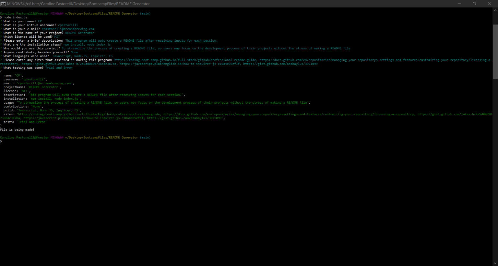

# README Generator
  
  

  ## Table of Contents
  - [Description](#description)
  - [Installation](#installation)
  - [Usage](#usage)
  - [Built With](#builtwith)
  - [License](#license)
  - [Contributions](#contributions)
  - [Website Shoutouts](#websites)
  - [Tests](#tests)
  - [Questions](#questions)

  ## Description

  [ScreenCast Tutorial of the Program](https://www.screencast.com/t/btNutk5U)

  This program will auto create a README file after receiving inputs for each section. Fill out in as much detail as possible each question that is asked. 
  - If there are multiple items to submit, separate them with a comma ( , )
  - To go to the next question, press ENTER
  
  Once each question has been answered, the file will generate automatically. If you wish to add any images or styling format, please feel free to review and edit your README file. 
 

  

  ## Installation
  To install this program and run it as intended, please use the following commands within your node.js server:

  -  npm install
  -  node index.js

  ## Usage

  To streamline the process of creating a README file, so users may focus on the development process of their projects without the stress of making a README file

  ## Built With
  
  Javascript, Node.JS, Inquirer, FS

  ## License
  The licensing for this project is:
  [MIT](https://opensource.org/licenses/MIT)

  ## Contributions
  Here is the list of individuals who have contributed to this program!
  
  None

  ## Website Shoutouts
  These sites helped contribute to the completion of this project
  
  - [Professional README Guide](https://coding-boot-camp.github.io/full-stack/github/professional-readme-guide) 
  - [Licensing A Repository](https://docs.github.com/en/repositories/managing-your-repositorys-settings-and-features/customizing-your-repository/licensing-a-repository)
  - [Markdown Badges](https://gist.github.com/lukas-h/2a5d00690736b4c3a7ba)
  - [Inquirer](https://javascript.plainenglish.io/how-to-inquirer-js-c10a4e05ef1f) 
  - [Anchors in Markdown](https://gist.github.com/asabaylus/3071099)
  
  ## Tests
  These are the tests that were done to the program:

  Trial and Error

  ## Questions
  If you have any questions, comments, or suggestions, please feel free to contact me! I am new to this and any advice/ help is appreciated!

  - [Github](https://github.com/cpastorelli)
  - [Email](cpastorelli@arcanabrewing.com)
